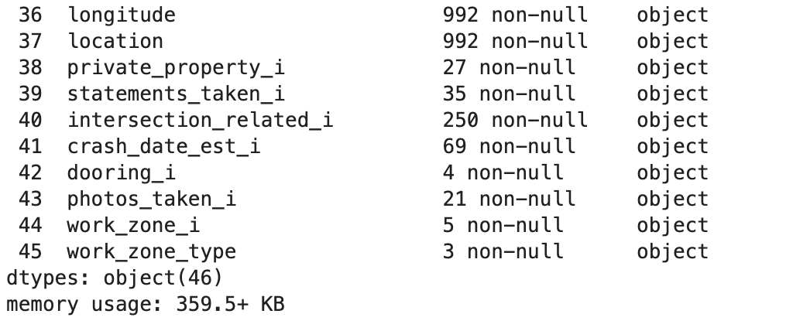
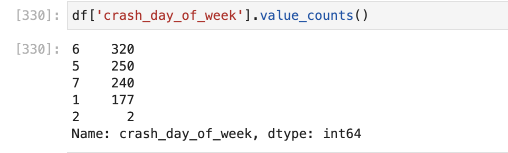
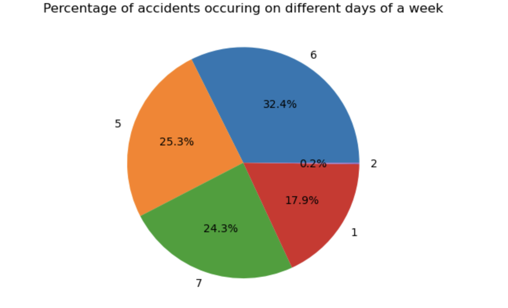
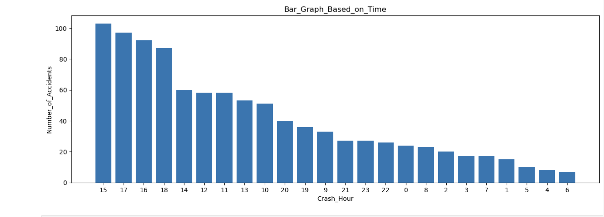
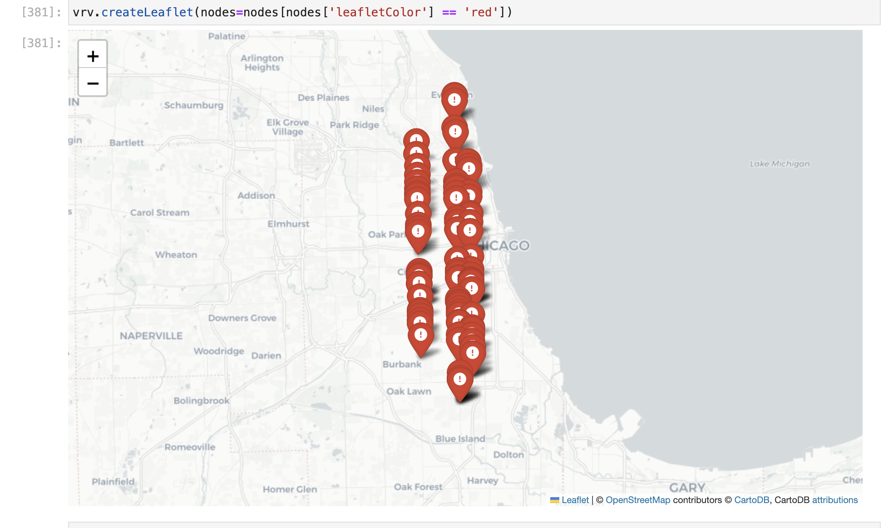

# Road Accidents in Chicago

Authors:  **Kundan Surya Teja Nanda**

YouTube Video:  [Link](https://youtu.be/sHbFtplKqNw)

---
## Task List

| ID | Task Description | Due Date | Status |
| --- | --- | --- | --- |
| 1 | Choose the dataset | 2023-04-10 | DONE |
| 2 | Preparing project proposal | 2023-04-18 | DONE |
| 3 | Installing Required Packages | 2023-04-26 | DONE |
| 4 | Converting the json file to data-frame | 2023-04-26 | DONE |
| 5 | Data Cleaning | 2023-04-26 | DONE |
| 6 | Visualizing the Data | 2023-04-28| DONE |
| 7 | Making Some Interpretations | 2023-04-28 | DONE |
| 8 | Created VeRoViz Nodes data-frame | 2023-04-30 | DONE |
| 9 | Plotting nodes on Leaflet map | 2023-05-02 | DONE |
| 10 | Color Coding the nodes | 2023-05-05 | DONE |
| 11 | Updating the MD file | 2023-05-16 | DONE |
| 12 | Complete YouTube video and upload to YouTube | 2023-05-16 | DONE |
| 13 | Upload README.md document to Github | 2023-05-17 | DONE |

--- 

## Introduction

As road accidents are increasing day by day in large cities like Chicago, we've decided to analyze the data and find new patterns by selecting the Chicago's road accidents dataset. The Crash data used in this project provides information on traffic accidents that occurred on city streets within the City of Chicago and under the jurisdiction of the Chicago Police Department (CPD). The data are derived from the electronic crash reporting system (E-Crash) at CPD which includes information regarding 'crash_id', 'crash_date', 'weather_conditions', 'lighting_conditions', 'longitude', 'latitude', 'crash_month', 'crash_hour', and 'crash_day_of_week'. All these records are added to the dataset when a crash report is completed or when changes are made to an existing report in E-Crash. 

However, approximately half of the crash reports are self-reported by drivers involved in minor accidents, while the other half are recorded by the responding police officer. The in-depth information regarding the crash parameters such as street names, road and weather conditions, street directions and posted speed limits, are recorded based on the best available information at that time by the reporting officer. However, this information may not always be accurate or may conflict with other assessments of road conditions. This dataset doesn't include any crash data that occurred on interstate highways, freeway ramps, and local roads along the City boundary.  

Moreover, based on the information we have from the crash dataset, we are going to identify the accident prone areas in the city of Chicago. We are also going to visualize the data for recognizing new patterns and making interpretations about the causes of the road accidents. 

---

## References

- The code retrieves data from [data.cityofchicago.org](https://catalog.data.gov/dataset/traffic-crashes-crashes)
- The visualization plots are made using [matplilib python library](https://matplotlib.org/stable/gallery/index.html)
- The accident prone areas were located in the map using [Vehicle Routing Visualization Software - VeRoViz](https://veroviz.org/)
- The data preprocessing was done using [pandas data-frame](https://pandas.pydata.org/)

--

## Requirements

To run this code we need few pre-requisites. Which include:
- Anaconda - jupyter notebook
    - Visit [Anaconda.com](https://www.anaconda.com/download/)
	- Select macOS or Windows and download the .pkg installer
	- Open the .pkg installer
	- Follow the installations instructions
	- Source your .bash-rc file 
	- Open terminal and type python code
- python version (Python 3.9.13 or higher)
- Import pandas data-frame ( **Pandas is a pre-installed package in Anaconda, if there is an error in importing the package follow these steps**)
    - After installing Anaconda we need to create an environment using the following command line in terminal.
	 > conda create -n name_of_my_env python
	 - To activate the python environment use:
	 > conda activate name_of_my_env
	 - To install the package
	 > conda install pandas
---

## Explanation of the Code

The code, 'Chicago_Accidents.ipynb', begins by importing necessary Python packages: 
``` python
import numpy as np
import pandas as pd
import os
import json
import matplotlib.pyplot as plt
import urllib.request
import veroviz as vrv

```
Here NumPy, Pandas and Json are very powerful python packages used for performing a variety of mathematical operations on arrays, to access labeled datasets, and to transfer data as text that can be sent over a network. These python packages are pre-installed with Anaconda and can be accessed directly along with **import** as shown above. 

Moreover, we also used data visualization package **VeRoViz** , **Matplotlib** for python which is used in creating static, animated, and interactive visualizations in python. 

Instructions for installing **VeRoViz**:
- Open the terminal
- Use pip to install VeRoViz
```
pip install veroviz
```
- To test the installation, use the following command
```python
import veroviz as vrv
vrv.checkVersion()
```

After importing the necessary packages we need to pull the data from the API. The data present in the API is in **.json** format. 

```python
with urllib.request.urlopen("https://data.cityofchicago.org/resource/85ca-t3if.json") as url:
    traffic_crashes = json.loads(url.read().decode())
traffic_crashes
```

The above code helps in pulling the data from the API and storing it in a variable **traffic_crashes** as a list of dictionaries. **Always remember, this API is updated on regular basis, so every time you run the above cell the data might change.** 

This list of dictionaries in now converted into a pandas data-frame using the code below: 

```python
df = pd.DataFrame(traffic_crashes)
df
```

Now the data looks more readable for the users. This dataset consists of 1000 entries and 46 variables. Here, entries are nothing but the rows i.e., each accident and variables are the columns. To, differentiate the accidents there is an **ID** for each and every accidents which is stored as **crash_record_id** 

The live data or real-world data which we have can be inconsistent, incomplete or may have many missing values due to human errors. So, using such data may lead to errors. Turing the the live data into useful format is known as data preprocessing. The most useful data preprocessing technique is Data Cleaning. 

Data Cleaning: The data can be noisy, or it can have a lot of missing values. We can deal with missing values either by replacing them with the most occurring values or the mean, median or mode values. The data is said to be noisy if the data is having some irrelevant data in between. This irrelevant data can either be deleted or it can be replaced After having the data we need to check if the data is clean. So, for that we can use the following code:
```python
df.info()
```



This gives the information about each and every column. As we can see there are few null valued columns. So, we can use the data cleaning technique and either remove these columns or replace them with mean, median or mode values. 

As we can see from the above figures that most of the data is clean but there are few columns like 'intersection_related_i', 'photos_taken_i', 'private_property_i', 'statements_taken_i','crash_date_est_i','work_zone_i','work_zone_type','dooring_i' which have very few non null values. So, as we don't have enough information about the data in theses columns we decided to drop these columns from our data frame. 

We also have a column named 'report_type' which only have two values in it either 'NOT ON SCENE' or 'ON SCENE'. As there are only few null values in this column we have decided to replace the null values with 'NOT ON SCENE' as this is the most common type of report filed. 

Data Visualization:

Data visualization helps in transforming the data into visual context which helps in understanding the data in more accurate way. The visualization can either be in a map form or a graph form whichever is feasible to identify the patterns and outliers from the data. Data visualization can be a bar graph, line graph, pie chart, scatter plot etc.

To visualize the data we have used the following code:
```python
x1 = df['crash_day_of_week'].value_counts().index.to_list()
y1 = df['crash_day_of_week'].value_counts().to_list()

print(len(y1))
plt.bar(x1,y1)

plt.xlabel("Crash_Day_of_Week")
plt.ylabel("Number_of_Accidents")

print(y1)
plt.title('Bar_Graph')
plt.savefig('BAR_GRAPH1.png')
plt.show()
```


In the above code we have plotted a bar graph based on the value counts of 'crash_day_of_week' column. 



So, 





Now, we have created a VeRoViz nodes data-frame to plot the pointers in map. 

```python
for j in range(0,len(nodes['accidents_count'])):
    if nodes['accidents_count'][j] >= 25:
        print('1', j)
        nodes['is_red'][j] = 1
        nodes['is_orange'][j] = 0
        nodes['is_yellow'][j] = 0
    if 10 <= nodes['accidents_count'][j] < 25:
        print('2', j)
        nodes['is_red'][j] = 0
        nodes['is_orange'][j] = 1
        nodes['is_yellow'][j] = 0
    if nodes['accidents_count'][j] < 10:
        print('3', j)
        nodes['is_red'][j] = 0
        nodes['is_orange'][j] = 0
        nodes['is_yellow'][j] = 1
```

We have added few extra columns, 'is_red', 'is_orange', and 'is_yellow' to the VeRoViz nodes data-frame, to differentiate the streets as high, medium and low risk of accidents. 

(High - 25 & above ; Medium- 10 to 25; Low - less than 10)



---

## How to Run the Code

1. Ensure that you have registered for the [insert name of API] API key.  (You may reference the instructions for doing this.)

2. Ensure that you have installed necessary Python packages.

3. Open jupyter notebook and run each and every cell. 

---

## Results from your Analysis
Finally, after observing the data we can see that the most number of accidents are during the weekend (i.e., Friday,Saturday and Sunday) and most of the accidents recorded are between 3PM and 6PM. We can also see that the climatic condition was recorded as clear for almost all accidents.  So, from this we say that the major cause was not due to bad weather. Finally, as all the accidents occurred durning the times, when people traveling back home from offices, we can conclude that these accidents are due to hurry. 